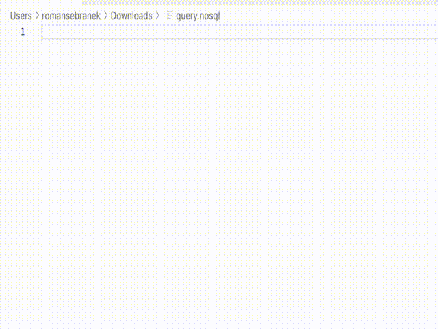

# Cosmos DB NoSQL Highlighter

Enhance your Visual Studio Code experience with the NOSQL Syntax Highlighter for Azure Cosmos DB. 
This extension provides advanced syntax highlighting for NOSQL queries and commands used in Azure Cosmos DB, making it easier to work with your NoSQL data.

## Features

Key Features:
- Highlight keywords, operators, and functions specific to NOSQL in Azure Cosmos DB.
- Distinguish between strings, numeric values, and other data types for better readability.
- Increase efficiency with snippets.
- Easily identify comments and documentation in your NOSQL code.
- Improve code comprehension and reduce errors when working with Cosmos DB queries.

Get started with the NOSQL Syntax Highlighter and take your Cosmos DB development to the next level. Happy coding!

## Syntax highlighting

## Snippets using
### List of snippets:

**Code snippets:**
- SELECT statement
- EXISTS expression
- JOIN statement
- OFFSET LIMIT clause
- BETWEEN keyword
- IN keyword

## Requirements
There are no specific requirements that the extension requires.

## Extension Settings
No special setting is required.

## Release Notes
Initial release of Cosmos DB NoSQL Highlighter Extension.

Initial release.

**Enjoy!**
